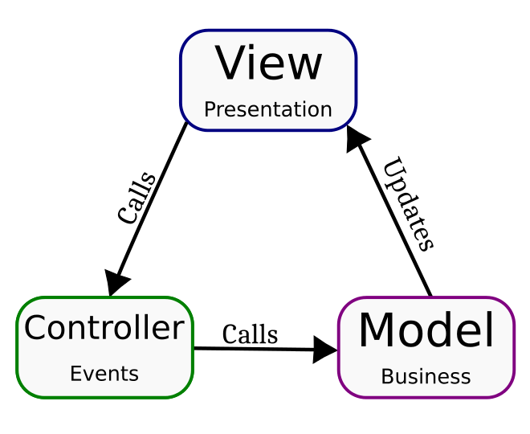

# MVC State


## The MVC patter
There are many definitions of what is MVC out there, here is the one this project follows:



## Storage

A storage is a way of sharing data.

```javascript
import { Storage } from 'mvc-state';

export class MyData {
    foo: number = 0;
    bar: number = 0;
}

export enum MyDataEvt {
    FOO = 'foo',
    BAR = 'bar',
    DEC_BAR = 'DEC_BAR',
}

export const MyDataStorage = new Storage<MyData>(new MyData());
```

We start by creating a class with all data to be shared called `MyData` in this example. Don't forget to give an initial value to EVERY property otherwise, it won't work properly later.
`MyDataEvt` will be responsible for providing you with the right events to listen.
## Model

Models hold all the business logic of your application.

```javascript
import { Model, IView } from 'mvc-state';
import { MyData } from '../../storage/MyData';

export class InputModel extends Model<MyData> {

    constructor(view: IView, storage: MyData) {
        super(view, storage);
    }

    public incFoo(value: number) {
        this.storage.foo += value;
        this.updateView({ foo: this.storage.foo });
    }
}
```

By default a model's constructor takes 2 parameters:
* `view` - That's the react component with all its properties
* `storage` - That's the object we created earlier

The `IntFoo` function shows the basic usage of these 2 objects. When `this.storage.foo` is set, an event
is sent out to every watcher listening to the `MyDataEvt.FOO` event. And `this.updateView` works like the
`setState` used by React.

Be aware that the view will only be updated when you call `updateView`.

## Controller

Controllers are responsible for listening to the view, storage events and talk to the model.

```javascript
import { Controller, Listener } from 'mvc-state';
import { InputModel } from './InputModel';
import { MyDataEvt } from './MyData';

export class InputCtrl extends Controller {
    private model: InputModel;
    private emit: Function,
    private listener: Listener,

    constructor(model: InputModel, emit: Function, listener: Listener) {
        super();
        this.model = model;
        this.emit = emit;
        this.listener = listener;

        // This will be triggered when some controller calls `this.emit(MyDataEvt.FOO, value)`
        this.listener.watch(MyDataEvt.FOO, (inc: number) => this.model.incFoo(inc));

        // This will be triggered when some controller calls `this.emit(MyDataEvt.DEC_BAR, value)`
        this.listener.watch(MyDataEvt.DEC_BAR, (dec: number) => this.model.incFoo(dec));
    }

    public onIncBar = () => {
        // Here we are calling the model
        this.model.incBar(1);
    }

    public onDecBar = () => {
        // Here we are emiting an event
        this.emit(MyDataEvt.DEC_BAR, -1);
    }
}

```

## View

The view is the presentation layer.

```jsx
import * as React from "react";
import { MyData, MyDataStorage } from "../../storage/MyData";
import { InputCtrl } from "./InputCtrl";
import { InputModel } from "./InputModel";

export class Input extends React.Component {
    public state: MyData;
    private ctrl: InputCtrl;

    constructor(props: any) {
        super(props);
        const dataModule = new InputModel(this, MyDataStorage.state);

        // The way to get a listener is to pass a unique id to the function MyDataStorage.getListner
        this.ctrl = new InputCtrl(dataModule, MyDataStorage.emit, MyDataStorage.getListner('InputCtrl'));
        this.state = new MyData();
    }

    render() {
        return (
            <div >
                <span >
                    <button onClick={this.ctrl.onIncBar}>+</button>
                    <p>Bar: {this.state.bar}</p>
                    <button onClick={this.ctrl.onDecBar}>-</button>
                </span>
            </div>
        );
    }
}
```

Not much to say here. It is just react. Every time you call `viewUpdate` in a model, the state will be updated, any event should be handled by the controller.
